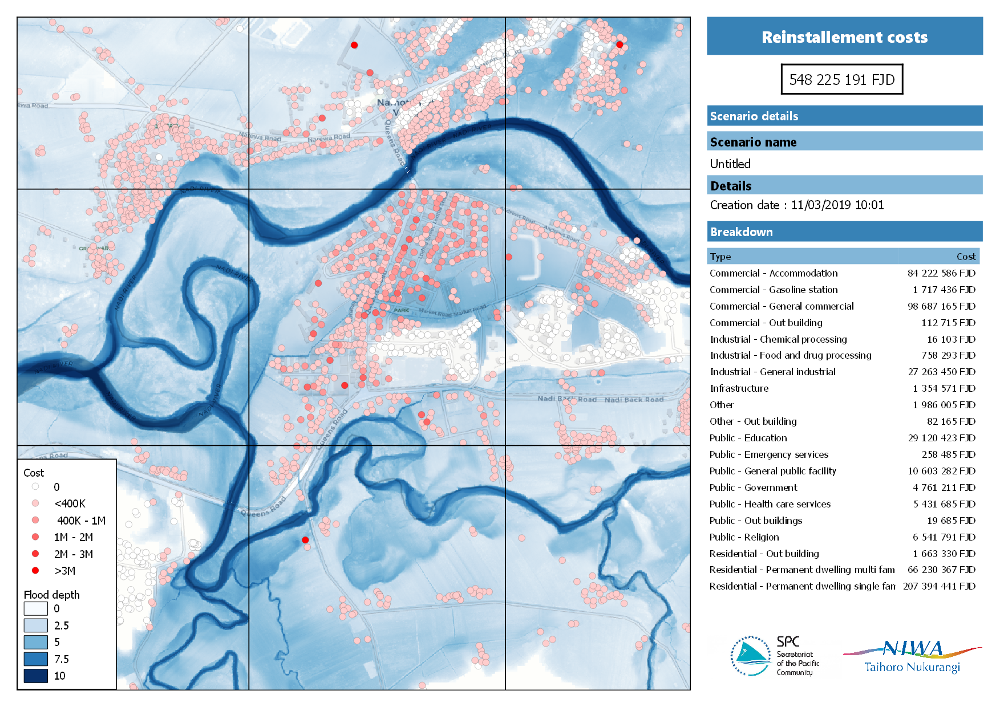
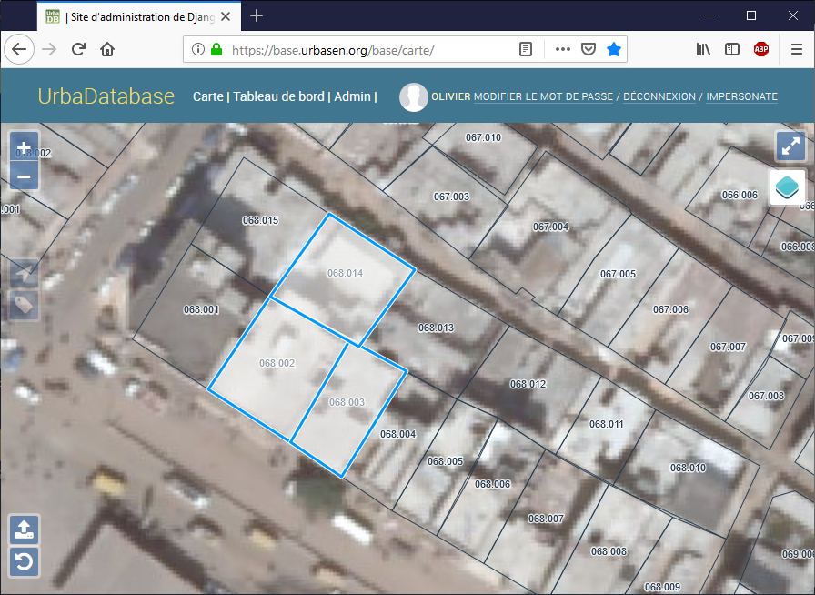
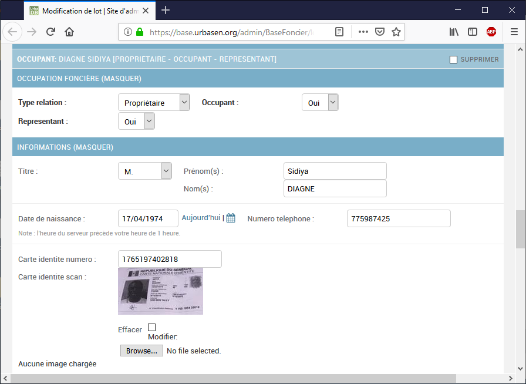
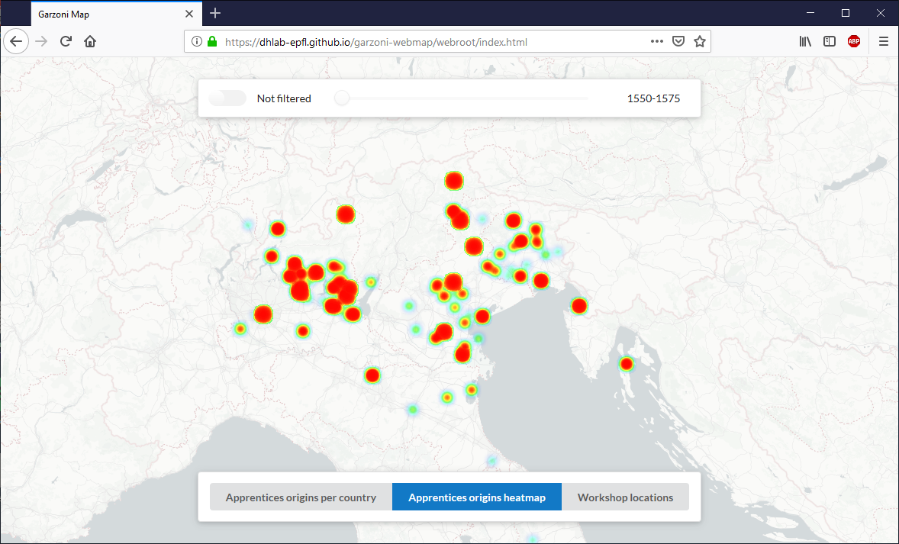
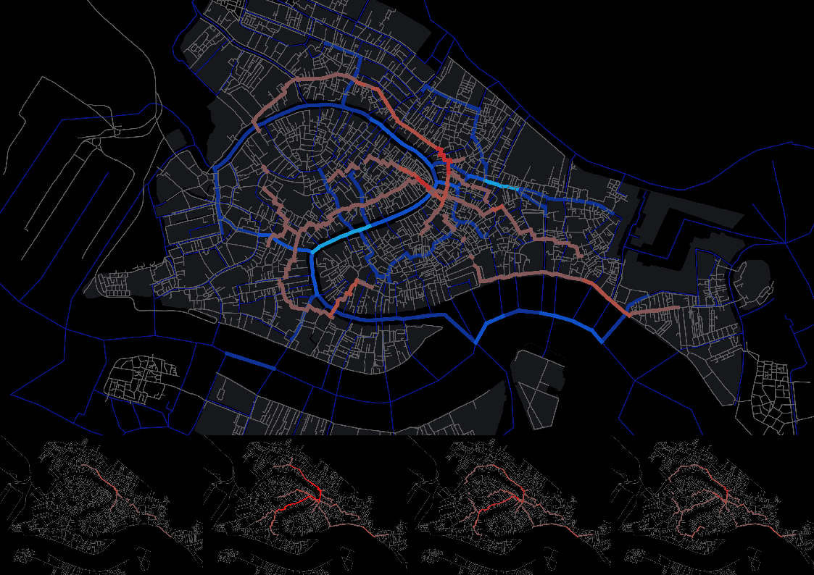

# Olivier Dalang / Selected work

This portfolio presents some of my previous GIS work.
 

## Natural disaster impact assessment workflow

**Client** : Pacific Community  
**Country** : Fiji  
**Tools** : QGIS, processing models, python plugins  
**Date** : 2018  

  
_Example of an automatically generated reinstallement cost analysis_

SPC regularly assists Pacific Countries in conducting damage assessments, both before disasters, based on scenarios, to inform preparedness strategies, and post diaster, to inform response.

This project aimed to create workflows to generate such assessments using QGIS. It consisted of a couple of QGIS processing workflows using some custom python algorithms.

Non-technical users were shown how to run the algorithms by just picking the hazard and the exposure layer, to automically generate PDFs.

Intermediate users were shown how to change the outputs by modifing styles or layouts in QGIS.

Advanced users were shown how to create custom analysis by changing the processing models.

## Geonode hosting

**Client** : Pacific Community  
**Country** : Fiji  
**Tools** : Geonode  
**Date** : 2017-2018  
**Links** : https://github.com/GeoNode/geonode/tree/master/scripts/spcgeonode  

  
_Customized Geonode deployment for coordination after cyclone Gita in Tonga_

SPC manages several geographical open data portals based on Geonode. Each of those portals was deployed independetly, leading each time to the same technical challenges. The goal of this project was to create a production-ready deployement method for Geonode, allowing to very easily deploy new Geonode data portals.

This method has been contributed back to the main Geonode repository and can now be used to deploy new instances.

## UrbaDatabase

**Client** : UrbaSEN  
**Country** : Senegal  
**Tools** : Django, QGIS  
**Date** : 2016  
**Visuals** : screnshots of UrbaDatabase, screnshots of AOF  

_Main view of the Django based app_

_Feature form : attach documents_

  
_Generated Occupation Certificate_

UrbaSEN is helping the Senegalese Federation of Inhabitants to document informal land ownership in flooded areas. With the local authorities, UrbaSEN is delivering Informal Occupation Certificates.

UrbaDatabase is a Django (Python) based application that allows to collect data in the field, to issue and validate Informal Occupation Certificates. Those certificates contain an automatically generated map showing the land lot.

## Senegal Flying Lab

**Client** : UrbaSEN  
**Country** : Senegal  
**Tools** : Pix4D  
**Date** : 2016  
**Links** : https://urbasen.org/projets/senegal-flying-lab  

  
_Extract of the generated base maps_

  
_Flying the drone_

In partnership with WeRobotics, UrbaSEN acquired skills in drone based mapping to support the aforementionned project.

The project consisted of training the local team in piloting drones, processing the imagery, loading and analysing it. 

## DTK local urban plan

**Client** : UrbaMonde,  
**Country** : Senegal  
**Tools** : QGIS  
**Date** : 2015  

  
_Plan d'Urbanisme de Détail_

UrbaMonde, in partnership with the local population of Djiddah Thiaroye Kao, the local authorities, and the swiss urban planning firm UrbaPlan, realized the first participartory _Plan d'Urbanisme de Détail_ of Senegal.

The contribution on this project was on the planning process and on the realisation of the final official maps using QGIS.

## DHLab - Venice Time Machine

**Client** : DHLab / EPFL  
**Country** : Switzerland  
**Tools** : OpenLayers, Virtuoso, python  
**Date** : 2015  

  
_Web view of the data_

The Digital Humanities Lab at EPFL is conducting a great project on historical data from the states archives of Venice.

The contribution on this project was the creation of editing interfaces and web views for the geographical data retrieved from those archives.

## DHLab - Visualising future cities course

**Client** : DHLab / EPFL  
**Country** : Switzerland  
**Tools** : OpenLayers, Virtuoso, python  
**Date** : 2014  

  
_Network analysis of historical network of venice (Student's work)_

The Digital Humanities Lab at EPFL was contributing to a course on urban data visualization. Amongst other things, students where teached how to conduct network analysis using QGIS.

## Open-Source contributions

Own QGIS plugins (Python)
- [https://github.com/olivierdalang/CadInput](https://github.com/olivierdalang/CadInput)
- [https://github.com/olivierdalang/VectorBender](https://github.com/olivierdalang/VectorBender)
- [https://github.com/olivierdalang/RasterBender](https://github.com/olivierdalang/RasterBender)
- [https://github.com/olivierdalang/liveStats](https://github.com/olivierdalang/liveStats)
- [https://github.com/olivierdalang/layerCombinations](https://github.com/olivierdalang/layerCombinations)

Contributions to other QGIS plugins (Python)
- [https://github.com/minorua/Qgis2threejs/commits?author=olivierdalang](https://github.com/minorua/Qgis2threejs/commits?author=olivierdalang)
- [https://github.com/nextgis/QTiles/commits?author=olivierdalang](https://github.com/nextgis/QTiles/commits?author=olivierdalang)

Contributions to QGIS core (c++)
- [https://github.com/qgis/QGIS/commits?author=olivierdalang](https://github.com/qgis/QGIS/commits?author=olivierdalang)

Contributions to Geonode (Django, Python)
- [https://github.com/Geonode/Geonode/commits?author=olivierdalang](https://github.com/Geonode/Geonode/commits?author=olivierdalang)

Contributions to other geospatial tools (Javascript)
- [https://github.com/walkermatt/ol3-layerswitcher/commits?author=olivierdalang](https://github.com/walkermatt/ol3-layerswitcher/commits?author=olivierdalang)
